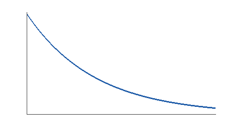

Atmospheric Simulation
======================

:Author: Simulation Team

Introduction
------------

This report contains the results of the atmospheric simulation.

Model
-----

.. math::
   :label: hydrostatic

   \frac{dP}{dz} = -\rho g

Results
-------

.. _density-profile:

   Atmospheric density profile

.. list-table:: 
   :header-rows: 1

   * - Parameter
     - Value
     - Unit
   * - Temperature
     - 273.15
     - K
   * - Pressure
     - 101325
     - Pa

See :ref:`density-profile` for the profile.

